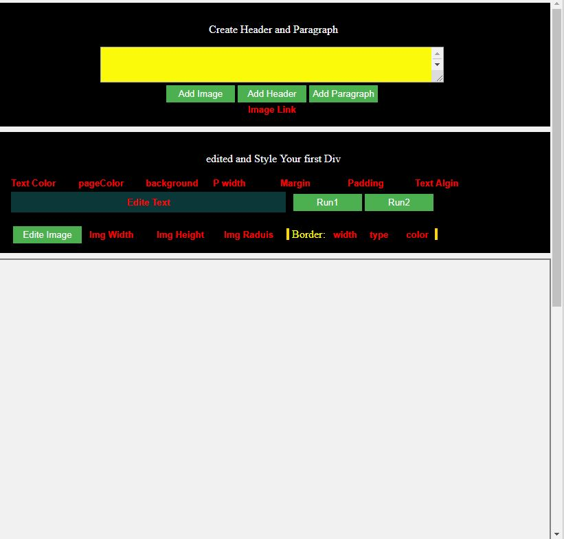
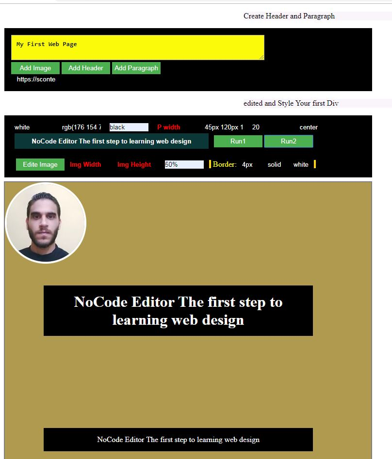

## NoCode-Editor

Javascript, HTML5 app create elements and add style to them , in order to create web site or
just help others basics of web design and rules for create elements and styles, 
This tool should be the first step when some one learn web design, NoCode Editor Easy to User 

## how to download:
* this file contains the all app NoCode_Editor(Desgin).html using inline js and css
* just download it and double click then start desgin your page

## About:
Javascript, HTML5, CSS applaction used to create and desgin virtual web page
using HTML DOM, and JS to create elements and style them.

## How To Use It:
1. First You Enter The text then click add header.
2. add image source link then click add Image.
3. You can control Image style by Enter Inputs width, border
4. to style your header or pargraph create header 
5. then copy the text into edite text and start edite.

## notes (Read It)

* Run 1 change heading style.
* Run 2 change P style.
* if you need to style the elements then you have to add the text before click run1 or run2.

## next update:
I will working on export the DOM of the nodes and the current style after user finish to adatabase 
then paste them into HTML file to give it back for him adding more options and nav bar I need make it Like wix.com

# app Image

# Author Mahmoud Magdy

